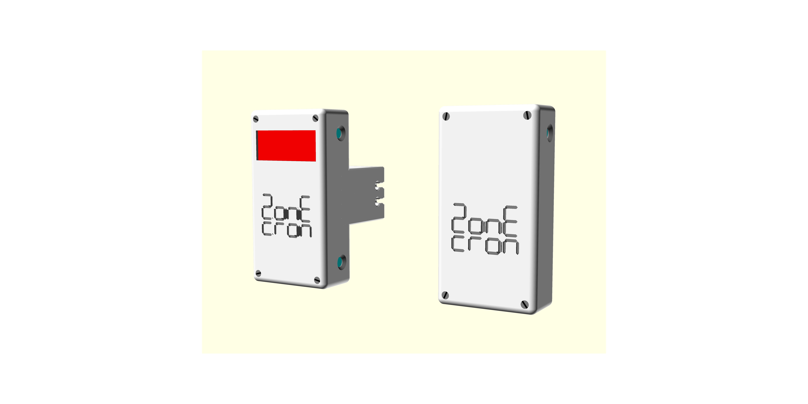
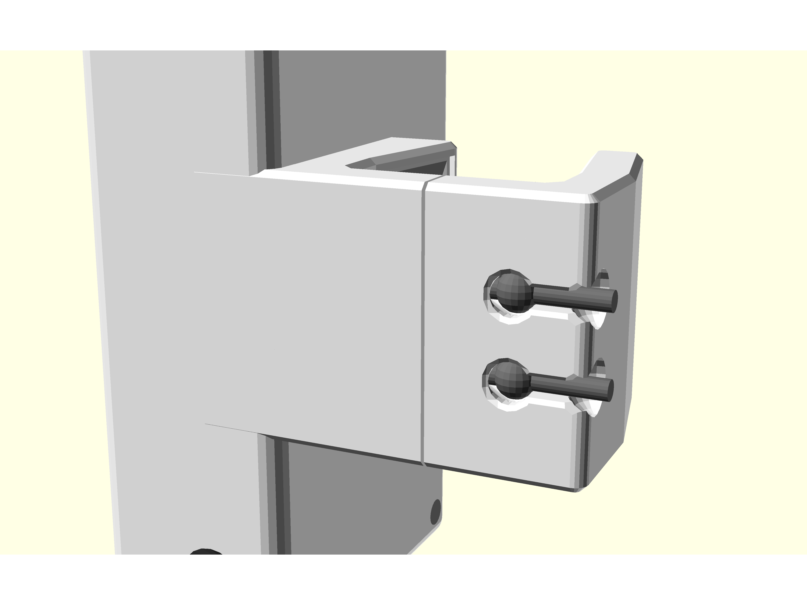
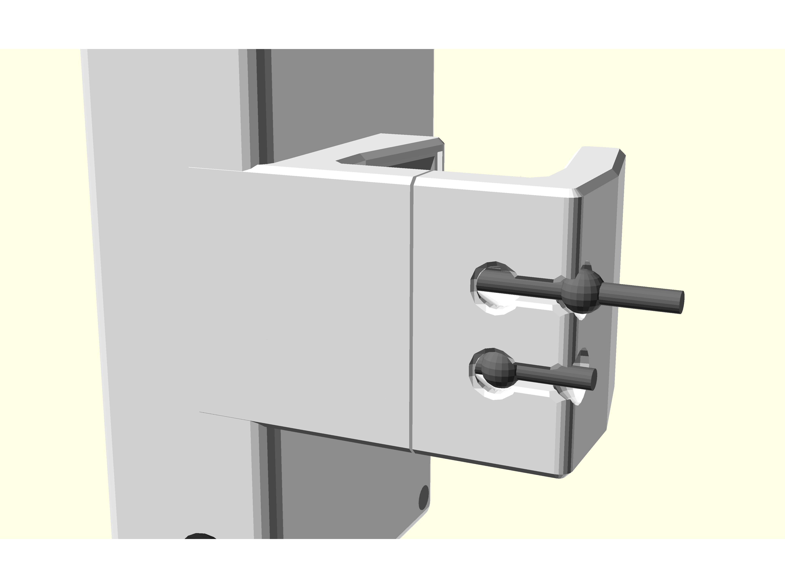
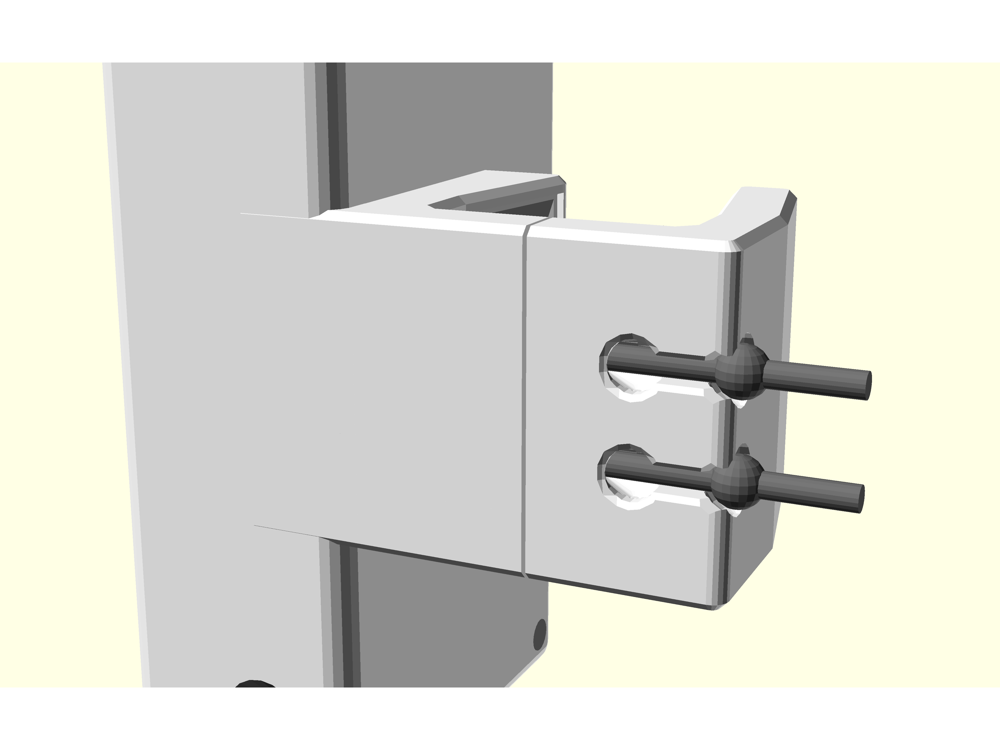
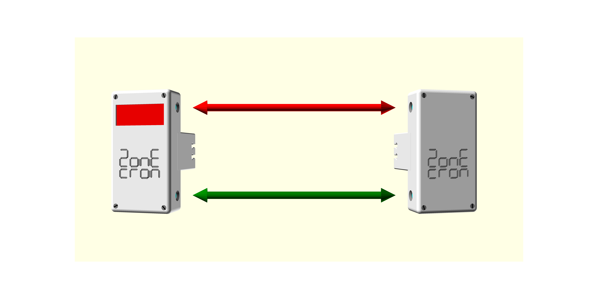
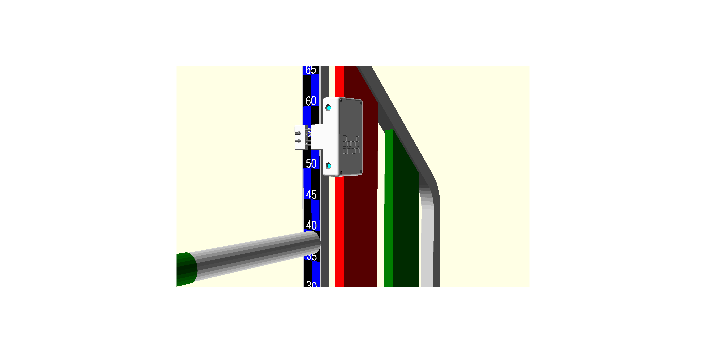

# ZonEcrón© Original
## Manual de Usuario

## Contenido

1. [Introducción](#1-introducción)
   - [1.1 Objetivo del equipo](#11-objetivo-del-equipo)
   - [1.2 Principales características](#12-principales-características)
   - [1.3 Comparadnos](#13-comparadnos)
2. [Uso](#2-uso)
   - [2.1 Montaje y encendido](#21-montaje-y-encendido)
   - [2.2 Alineación y detección](#22-alineación-y-detección)
   - [2.3 Auto-interferencia de infrarrojos](#23-auto-interferencia-de-infrarrojos)
   - [2.4 Comunicación radio](#24-comunicación-radio)
   - [2.5 Visualización en pantalla](#25-visualización-en-pantalla)
   - [2.6 Alimentación y recarga](#26-alimentación-y-recarga)
   - [2.7 Autonomía](#27-autonomía)
   - [2.8 Sol y lluvia](#28-sol-y-lluvia)
   - [2.9 Almacenaje](#29-almacenaje)
3. [Epílogo](#3-epílogo)
4. [Contacto](#4-contacto)

## 1 Introducción

### 1.1 Objetivo del equipo

El ZonEcrón©, y cuando decimos ZonEcrón© queremos que imaginéis luces de neón y fuegos artificiales al fondo (vale, esta parte me la voy a saltar el resto del manual que si no se va a hacer muy largo), como decía, el ZonEcrón© se ideó para cubrir la necesidad de cronometrar el tiempo de ejecución de zonas (pasarela, empalizada y balancín) y lógicamente, también permitiría cronometrar secuencias cortas para determinar qué opción es mejor.

Bajo esta premisa, dada nuestra naturaleza tendente al mínimo esfuerzo, añadimos una serie de condicionantes, como son fácil instalación, sin cables, etc., y empezamos a tontear con diferentes tecnologías (infrarrojos, radio, baterías, pantallas, etc.) que nos acercaban a nuestro resultado final.
Finalmente, el ZonEcrón© nace con el objetivo de satisfacer la necesidad de cronometraje en entrenamientos de agility, y es a este entorno al que pretendemos circunscribirlo.

Aunque las características del equipo permiten utilizarlo como cronómetro de competición, serían recomendables algunos añadidos (pantalla grande, conexión al software de la prueba, una pareja adicional de repuesto, etc.) para usarlo con ese propósito.

### 1.2 Principales características

- Compacto, de tamaño reducido con todo lo necesario integrado.
- Rápido de colocar, que no dé pereza montarlo, o al menos no mucha.
- Apto para exterior, visible al sol y con cierta protección a la lluvia.
- Recargable, por USB y autonomía superior a 30h.
- Seguro: Señales inocuas (infrarrojos y wifi) y sin esquinas.
- Sujeción firme, en el ala, para cualquier material (plástico, aluminio, hierro).
- Inalámbrico. No se usa ningún cable salvo para cargar baterías.
- Largo alcance de comunicación. Probado 80m., recomendado 40m.
- Pantalla integrada de 4 dígitos con la máxima resolución que permita el tiempo a mostrar (milésimas, centésimas, décimas o segundos).
- Doble sensor, superior e inferior, en cada puerta.

### 1.3 Comparadnos

Creemos que hemos desarrollado un producto único en prestaciones. Nosotros no hemos encontrado otro producto que reúna todas las características que reúne el ZonEcrón©, que no repetiremos ahora.

Cuando nos surgió la necesidad de disponer de un cronómetro de entrenamiento, estuvimos buscando mucho y bien y sí encontramos otros productos, que tenían el mismo objetivo, pero ninguno reunía todas las exigencias así que por eso nos decidimos a crearlo nosotros mismos.

Si tenéis una necesidad concreta que el ZonEcrón© no satisface, hay otros productos similares. Os invitamos a que busquéis, comparéis y si encuen… bueno eso, … una mente que pregunta es una mente despierta.

## 2 Uso

### 2.1 Encendido y colocación

Una pareja de ZonEcrón© original la forman el emisor de infrarrojos (la caja sin pantalla) y el receptor de infrarrojos (la caja con pantalla). 

Ambos disponen de una pinza con uno de los lados fijo en la caja y el otro deslizante guiado por dos varillas de acero. Mediante una goma interna, ambos lados de la pinza permanecen juntos. Esta goma puede ajustarse rápidamente a 3 niveles de tensión, moviendo los extremos anudados de la goma, para adaptarse a diferentes grosores de la estructura del ala o palo. Ver fotos a continuación:
  
|                Mínima tensión                        |               Media tensión                          |               Máxima tensión                         |
|------------------------------------------------------|------------------------------------------------------|------------------------------------------------------|
|  |  |  |
| Perfil de valla ancho.                               | Para tubo redondo.                                   | Perfil de valla estrecho.                            |
| p. ej. saltos de aluminio.                           | p. ej. saltos de pvc o palos del longitud.           | p. ej. saltos de acero galvanizado.                  |

Deslizando la pinza para abrirla, colocamos el ZonEcrón© a la parte vertical del ala (o a un poste del salto de longitud). Pondremos a la derecha el emisor y a la izquierda el receptor, de modo que queden más o menos alineados los dos emisores con los dos receptores:

A continuacion procedemos a encender el emisor y el receptor. 
Para verificar que el emisor está encendido basta con comprobar el LED azul, que estará fijo, o parpadeando (si queda poca batería). 
En el caso del receptor, la luz azul se encenderá nada más encenderlo, en pantalla se mostrarán varios mensajes en el display. Una vez aparece en pantalla el tiempo a cero (0.0) la luz azul se apagará si detecta correctamente los infrarrojos del emisor. Aunque orden de encendido y montaje es indiferente, recomendamos que primero colocar los equipos en su posicion y luego encender primero el emisor (sin pantalla) para que al encender después el receptor (con pantalla), podamos comprobar el nivel de bateria de ambos en los mensajes iniciales en pantalla.

**Es de vital importancia** dejar separación entre el palo y el emisor inferior para maximizar las probabilidades de detección. Recomendamos que el emisor inferior esté 10cm por encima del palo en XS, S y M, y 15cm por encima del palo para L y XL.
Por ejemplo, para M debe quedar así:

### 2.2 Alineación y detección

Una vez el emisor y receptor se encuentran uno en frente del otro y están encendidos, la luz azul del receptor se apagará si la alineación es correcta y no hay obstáculos interrumpiendo el haz de infrarrojos. En el momento en el que el haz se interrumpe (por paso o desalineación), se encenderá el LED azul del receptor un mínimo de 0,5s, o si la interrupción dura más tiempo, se mantendrá encendido ese tiempo.

El emisor dispone de 2 LEDs de infrarrojos, uno superior y otro inferior, a su vez el receptor dispone de un receptor superior y otro inferior. La recepción es selectiva de modo que el receptor superior solo atiende al infrarrojo enviado por el emisor superior. Idem con la pareja inferior. Esto genera en la práctica dos barreras rectas que van del emisor al receptor. No hay detección cruzada. 
Si cualquiera de estas barreras es interrumpida se iniciará o detendrá la cuenta de tiempo. Ojo a la hora de colocar emisor y receptor demasiado cerca uno del otro o en paralelo a paredes, ya que la potencia del emisor es suficiente como para rebotar en sólidos cercanos o su resplandor (invisible) es capaz de sortear una mano si tenemos ambos apoyados en una mesa, porque lo estamos probando, por ejemplo.

Recomendamos una distancia mínima de uso de 1m. La distancia máxima depende de la cantidad de luz ambiental. Varía, desde 2 metros a plena luz del día, hasta 20m en condiciones de oscuridad con iluminación de focos artificiales en pista.

### 2.3 Auto-interferencia de infrarrojos

Debido a la potencia empleada en los infrarrojos para funcionar a plena luz del sol, puede ocurrir que un receptor reciba los infrarrojos de 2 emisores. Este efecto es más acusado en condiciones de poca luminosidad ambiental o en espacios cerrados.
El síntoma más aparente es que la luz azul de un receptor esté constantemente encendiéndose y apagándose pudiendo llegar a iniciarse y pararse el conteo de tiempo sin que se haya cortado el haz.

Esto se debe a que un receptor recibe los infrarrojos de 2 emisores a la vez, por la colocación en pista o por rebote en superficies cercanas (paredes o cristales). Por ejemplo, en este caso el receptor 1 (R1) recibe los infrarrojos del emisor 1 (E1) y el emisor 2 (E2):

Para evitar esto colocaremos los receptores de forma que solo puedan recibir los infrarrojos de un solo emisor, por ejemplo, cambiándolos de lado en el salto. En el ejemplo anterior haremos esto:

Si obligatoriamente tenemos que mantener la pareja 2 en mismo lado del salto, podremos usar unos postes del salto de longitud, o en última instancia ponerlos boca-abajo:

### 2.4 Comunicación radio

La comunicación de radio se establece de forma automática entre todos los elementos de la faminia ZonEcrón©. Esta comunicación funciona en el rango de las frecuencias wifi, y puede verse afectada si se utiliza en entornos con muchas redes wifi presentes. 

El ZonEcrón© original dispone de una antena interna en cada receptor (caja con pantalla) para establecer esta comunicación. Los resultados óptimos de fiabilidad de comunicación y distancia se obtienen cuando ambos receptores están en posición vertical, o sea, en su posición de montaje habitual. 

El alcance máximo teórico es de 80m. en campo abierto. Experimentalmente se ha comprobado un alcance de 200m. en un parque de un entorno residencial con varias redes wifi de las viviendas circundantes, sin fallos de comunicación. Lo recomendable es no exceder los 40m en su uso en una pista de dimensiones reglamentarias, para un desempeño óptimo.

### 2.5 Visualización en pantalla

Una vez encendido el receptor, y mostrados los diferentes mensajes tal y como se ha explicado anteriormente, visualizaremos en pantalla “0.0” en los dígitos centrales. Si se inicia un cronometraje en uno de las dos parejas emisor-receptor, el tiempo comenzará a correr en ambas pantallas. Mientras el tiempo está corriendo, se mostrarán en pantalla los segundos y la décimas de segundo, pudiendo moverse la posición de los dígitos si los segundos exceden de 99, o desapareciendo las decimas si los segundos exceden de 999.

Una vez detenido el cronometraje, el display mostrará el tiempo con la mayor resolución posible:

| Resolución | Desde  | Hasta  | ejemplo |
|------------|--------|--------|---------|
| milésimas  | 0.000s | 9.999s |  5.417  |
| centésimas | 10.00s | 99.99s |  54.17  |
| décimas    | 100.0s | 999.9s |  541.7  |
| segundos   |  1000s |  9999s |  5417.  |

Ambas pantallas marcarán el mismo tiempo puesto que se sincronizan al inicio, durante y al final del cronometraje.

### 2.6 Alimentación y recarga

Los 4 equipos, 2 emisores y 2 receptores, disponen de una batería interna de litio, recargable. Por lo tanto, no es necesario ningún cable de alimentación o comunicación, durante su uso. 

Los niveles de batería se pueden verificar al encender un receptor teniendo delante su emisor encendido. A parte, los emisores (sin pantalla) indicaran un nivel de batería baja haciendo parpadear lentamente el led azul, y un nivel muy bajo haciéndolo parpadear rápidamente. 

Esta indicación del nivel de carga **es aproximada**, ya que lo que realmente se mide es el voltaje de la batería que esta más o menos ligada a la carga restante, pero no es infalible. Por lo tanto, puede que veais que el porcentaje baja rápidamente de 100% a 90%, luego se mantiene bastante tiempo entre 90% y 10% y luego del 10% al 0% baja más rápido. También puede suceder que en sucesivos encendidos y apagados, el porcentaje indicado fluctúe, por lo tanto, insistimos en que se trata de una indicación aproximada.

Los equipos cuentan con una toma usb-C en la parte inferior. Para la recarga de estas baterías, deben estar apagados y basta con conectar un cable USB estandar a un cargador USB o un puerto USB de un ordenador. Por la diferencia de los conectores en los cables USB, no es físicamente posible conectarlos mal, así que hasta el más torpe está a salvo. 

**CUIDADÍN**: En versiones anteriores el conector del euipo era micro-USB, y es posible dañar este conector si nos empeñamos en introducir el cabezal del cable de carga en la posición errónea, ya que solo admite una orientación.

**ATENCIÓN PELIGRO: NO CARGAR LOS EQUIPOS SIN SUPERVISON.**
Ningún equipo a baterías debería ser cargado sin supervisión. Es habitual dejar el móvil enchufado toda la noche y no pasa nada. Pero el hecho de que no pase, no quiere decir que no pueda pasar. No hace mucho, una gran empresa tuvo problemas con las baterías de sus móviles que al cargarlas se sobrecalentaban, llegando a explotar. Por eso, protegeos y proteged a los vuestros. No se trata de estar 4 horas mirando fijamente que todo vaya bien, pero si se ponén a cargar los equipos, es recomendable estar cerca haciendo otras cosas, y si no es posible quedarse cerca, recomendable desconectarlos, y proseguir la carga en otro momento. Estas baterías no tienen memoria y se pueden cargar "a plazos" sin problema.

**ATENCIÓN PELIGRO: REVISAR EN CASO DE IMPACTO.**
Es más que probable que en algún momento, algún perro impacte con el ala en la que está el ZonEcrón© o directamente impacte con el ZonEcrón©. En el diseño del ZonEcron se ha procurado hacer el equipo lo mas resistente posible, y sujetar firmemente las partes internas, pero ante tal circunstancia es obligatorio inspeccionar el equipo minuciosamente. Si se observá algún desperfecto, si suenan partes sueltas en el interior o si se sobrecalienta al cargarlo, se deba apagar y desconectar el equipo inmediatamente y se debe colocar en una zona donde no pueda provocar un incendio. Poneos en contacto con nosotros para ver que soluciones podemos aplicar. 

Dicho lo cual, el ZonEcrón© dispone de un circuito electrónico que controla la carga y descarga de las baterías. Impide que se carguen o descarguen en exceso. La indicación de 0% de batería, o parpadeo rápido en el caso del emisor, es el nivel mínimo de batería recomendado, a partir del cual se debería recargar el ZonEcrón©. No obstante, seguirá encendido exprimiendo al máximo la batería hasta que el circuito electrónico de protección corte la alimentación. Esto puede permitir usar el ZonEcrón© el caso de apuro, pero no es recomendable que sea la práctica habitual ya que afectará negativamente a la vida util de las baterías. 

Por ultimo, esa sabiduría popular que recomienda descargar las baterías del todo antes de volver a cargarlas, es válida para las antiguas baterías de Ni-Cd. Para estas "nuevas" (esta tecnología ya no es nueva) baterías de litio, es mejor no descargarlas del todo (de hecho, resulta perjudicial). Es mucho mas recomendable recargarlas estando a media carga. Incluso cargarlas a intervalos, un rato ahora y otro, no tiene impacto negativo. 

### 2.7 Autonomía

Un ZonEcron original nuevo tiene una autonomia superior a 40 horas, un margen muy amplio para uso como celulas en un crono en una de competicion de un día y mucho mas que de sobra para un entrenamiento. Esta autonomía irá disminuyendo con el paso del tiempo por la vida util normal de las baterias de litio.

La temperatura ambiente tambien pueden afectar negativamente a la duracion de la bateria:
- Para el uso, a más frío, menos duración. No es aconsejable usar los equipos en temperaturas inferiores a 0ºC
- Para la recarga, se aconseja que se haga a temperaturas moderadas entre 10ºC y 30ºC para garantizar una carga correcta y completa

Para incrementar la autonomía se han adoptado las siguientes estrategias:
- Cuando el crono está corriendo la pantalla baja el brillo puesto que la información del tiempo util es la medición final. Cuando el crono se detiene el brillo de la pantalla se pone a tope.
- Una vez parado el crono, pasados 30s de inactividad, se vuelve a reducir el brillo del a pantalla. y pasados otros 30s la pantalla se apagará y solo se encenderá intermitentemente 1s de cada 5s.

## 2.8 Sol y lluvia

El ZonEcron original ha sido diseñado para funcionar perfectamente en exteriores bajo el sol o la lluvia. 
- Su caracteristico color blanco ha sido elejido a proposito para evitar que se caliente bajo el sol, 
- Su diseño permite su uso bajo la lluvia siempre que se respete su colocacion en vertical con los conectores hacia abajo para evitar la entrada de agua por dichos orificios.

## 2.9 Almacenaje

A la hora de guardar el ZonEcron hay que tener en cuanta la humedad y la bateria:
- En primer lugar, y como ya se ha mencionado, el ZonEcron es a prueba de lluvia pero no de humedad. Si se mantiene humedo varios días, la humedad ira penetrando poco a poco en la envolvente y puede llegar a dañar irremediablemente los componentes electronicos. Por ello, si se ha usado bajo la lluvia, antes de guardarlo se debe dejar en un ambiente seco durante un dia para eliminar completamene la posible humedad.
- En segundo lugar, en lo relativo a la batería, si se tiene previsto no utilizar el ZonEcrón© en una temporada, lo mejor es dejar las baterías a media carga para maximizar su vida útil. Almacenar baterías de litio totalmente cargadas o descargadas periodos prolongados, puede disminuir sus prestaciones enormemente.

## 3 Epílogo

Disfrutad con vuestros perros, no os dejéis llevar por la frustración al comparar tiempos con los de los demás (aunque el pique sano hace que los entrenos sean más divertidos). Solo tenéis que competir contra vosotros mismos, y este crono pretende ayudaros a buscar la linea más fluida y rápida para vosotros y vuestros perros. 
Os deseamos que le saquéis el máximo partido al ZonEcrón©, y ya sabéis, ni un puto rehúse por ahorrar un paso, un rehúse por vagos no... Echadle ganas hostiasssss...

## 4 Contacto

Para soporte técnico, dudas o sugerencias, podéis contactar con nosotros a través de nuestro correo electrónico: [zonecron@gmail.com](mailto:zonecron@gmail.com)
